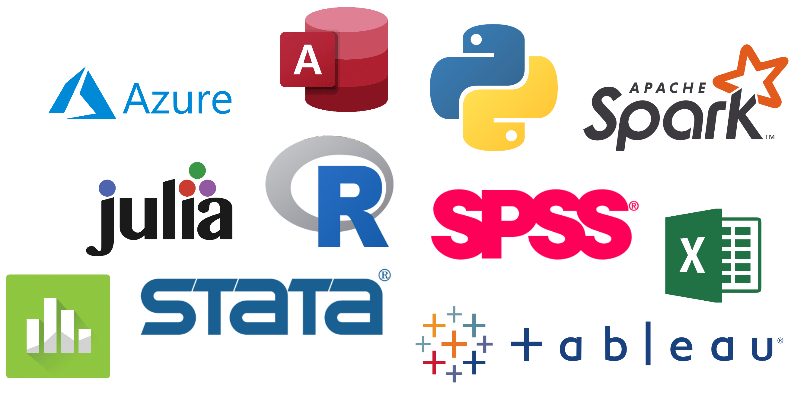
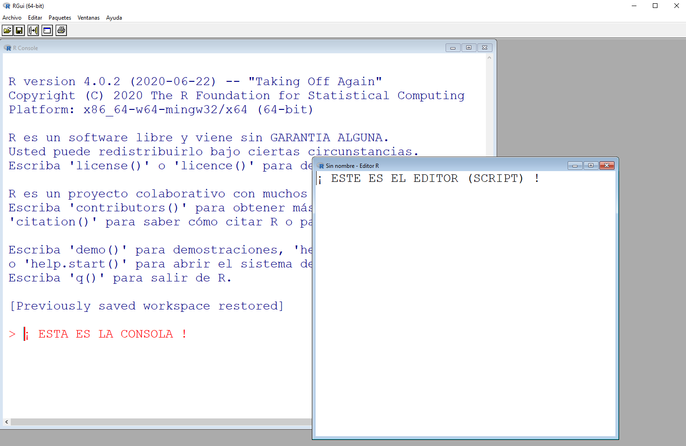
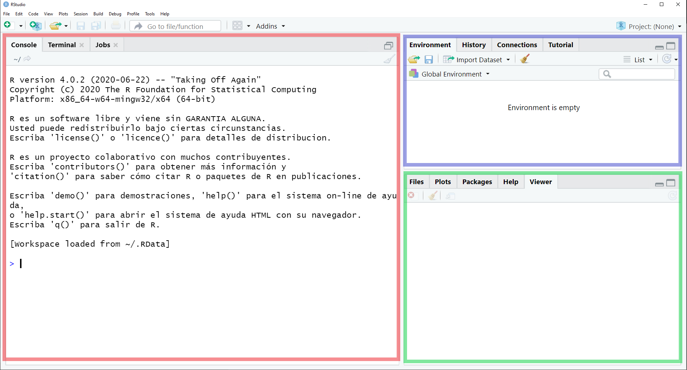
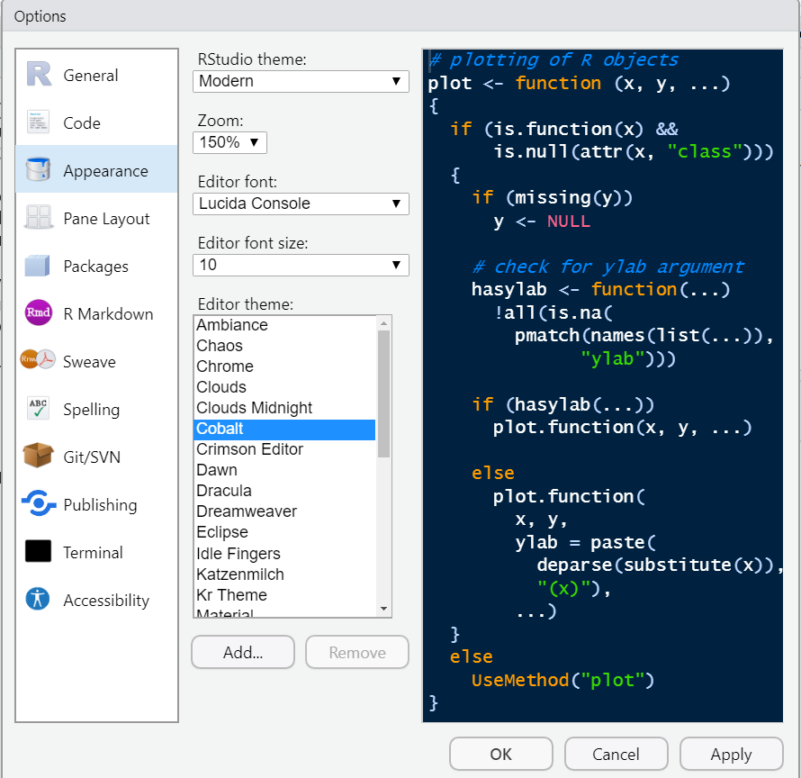
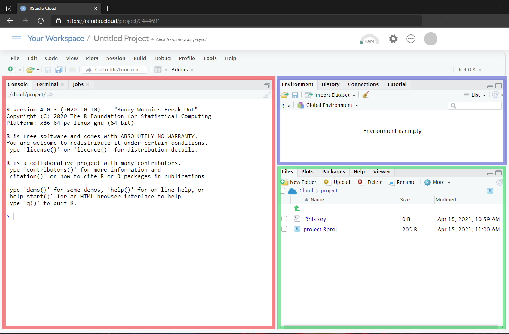
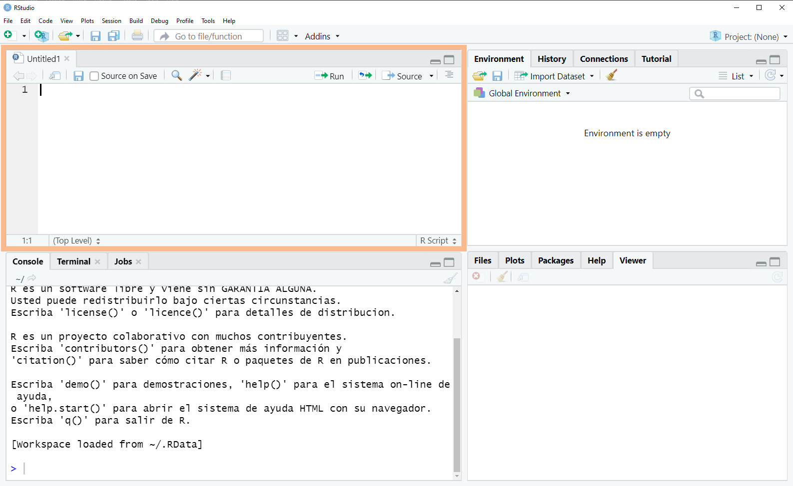
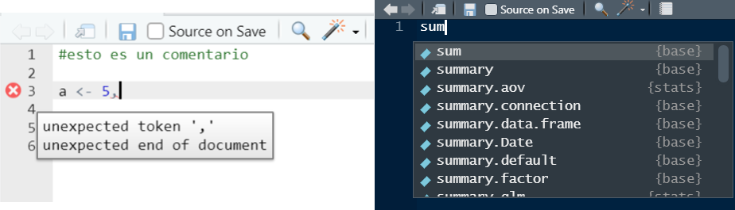
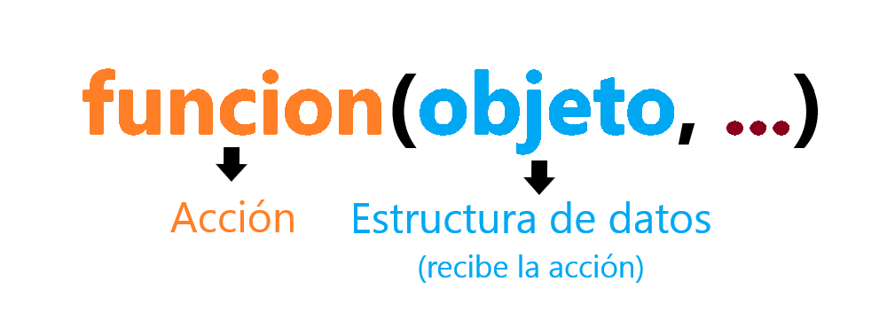

class: left, bottom
background-image: url(media/logo.png)
background-position: 95% 7%
background-size: 40%

# `r rmarkdown::metadata$title`
----
## `r rmarkdown::metadata$subtitle`
### `r rmarkdown::metadata$author`
### `r rmarkdown::metadata$date`

---
class: left, middle

# Clase 1: Introducción a R

.pull-left[
.left[

* [**Introducción**](#intro)

* [**R, RStudio y RStudioCloud**](#erre)

* [**Script, comentarios y secciones**](#script)

* [**Directorios de Trabajo y Proyectos**](#proyectos)

* [**Cálculos**](#calculos)
]

] <!--end of left-column-->

.pull-right[
.left[

* [**Funciones**](#funciones)

* [**Objetos**](#objetos)

* [**Paquetes**](#paquetes)

* [**Errores**](#error)

* [**Referencias y material complementario**](#adios)
]

] <!--end of right-column-->


---

```{r xaringan-themer, include=FALSE, warning=FALSE}
library(xaringanthemer)
style_mono_light(base_color = "#23395b",
#style_duo(
 # primary_color = "#576675",
 # secondary_color="#f5f5dc", # FF7373
  header_font_google = google_font("Fjalla One"),
  text_font_google   = google_font("Roboto"),
  code_font_google   = google_font("Fira Mono")
)


```

## Recomendaciones Generales

<h3><u> Si tienes alguna duda,¡pregunta! </u></h3>
<p style='text-align: justify;'>Los ayudantes estarán disponibles para ser consultados durante las clases, mediante el chat de Zoom, y fuera de ellas, mediante correo electrónico. Los ayudantes de esta sección son los siguientes:</p>

.pull-left[
<h3>C - Sección Vaughn</h3>
<ul>
	<li> Camila Paredes - ceparedes@uc.cl </li>
	<li> Benjamin Urrutia - burruta@uc.cl </li>
</ul>
]

.pull-right[
.center[

]
]

---


# Recomendaciones Generales 


.pull-left[
.left[

<h3><u> ¡Trata de tener más de una pantalla! </u></h3>


Tener una segunda pantalla para las clases es ideal, puede ser tú celular, una tablet o incluso un televisor. Esto les permitirá ver al mismo tiempo las clases y trabajar en tú propio computador.

]
]


.pull-right[
.center[

</br>


]
]

---
name: intro
class: inverse, center, middle

# Introducción


---
# Data Science - Flujo de trabajo

.center[]

.center[
Ilustración por [Allison Horst](https://github.com/allisonhorst) basada en el esquema de flujo del libro R for Data Science de  Grolemund & Wickham.
]

---
# Herramientas y software para DS
.center[]
.pull-right[.center[¡Entre otros!]]
---
name: erre
class: inverse, center, middle

# R, RStudio y RStudioCloud


---

# R y RStudio

.pull-left[
.center[


<h3 align="center"> R </h3>

<p style='text-align: justify;'>Es un lenguaje y entorno para computación estadística y gráficos. En este entorno se implementan  técnicas estadísticas y se extiende muy fácilmente a través de paquetes. Está disponible  como software libre. </p>
]
]

.pull-right[
.center[


<h3 align="center"> RStudio </h3>

<p style='text-align: justify;'>Es un entorno de desarrollo integrado (IDE) para R. Incluye varios elementos que facilitan las tareas durante el flujo de trabajo. </p>

]
]
---

# Instalación (Video)


.left[En el siguiente video se puede ver el paso a paso de donde descargar e instalar R y RStudio:]


.center[
<video height="250" controls>
  <source src="media/instalacion.mp4" type="video/mp4">
</video>
]

.left[Los links de descargas se pueden encontrar a continuación:] 

- [Descargar R](https://cran.r-project.org/)
- [Decargar RStudio](https://www.rstudio.com/products/rstudio/download/)


---
# R

Así es como se ve R:

.center[

]


Tenemos una ventana que corresponde a la **consola** y otra que es el **editor** o **script**.

---
# RStudio

Así es como se ve RStudio:

.center[

]


Tenemos varios espacios de trabajo dispuestos en 3 paneles:
<ul>
<li><span style="color: red;">  Consola .</span> </li>
<li><span style="color: blue;">  Environment  </span> (ambiente de trabajo). </li> 
<li><span style="color: green;">  Panel de visualización y ayuda. </span> </li>
</ul>
---
# RStudioCloud

.pull-left[
<p style='text-align: justify;'>
Si no queremos/podemos instalar R en nuestros equipos, tenemos la opción de usar su versión en la nube, llamada <a href='https://rstudio.cloud/'>RStudioCloud<a>.</p>

<p style='text-align: justify;'>A diferencia de RStudio, para empezar a trabajar con RStudioCloud necesitamos crear un <b>proyecto</b>.</p>

<p style='text-align: justify;'>El plan gratuito de RStudioCloud es suficiente para el trabajo que realizaremos en el diplomado, uno puede crearse una cuenta accediendo al siguiente <a href='https://rstudio.cloud/plans/free'>link</a>.</p>


]

.pull-right[

]
---
class: inverse
# Personalización

<p style='text-align: justify;'> Un aspecto importante de RStudio y RStudioCloud es que podemos personalizar la apariencia de nuestro programa. Como estaremos expuestos a muchas horas de programación es recomendable cambiar el tema predeterminado a uno oscuro, esto se hace en: <b><code style="color: white;">Tools > Global Options > Appearence </code></b> </p> 


.center[  ]


---
# RStudioCloud
Así es como se ve RStudioCloud, es prácticamente igual a RStudio:

.center[

]


Tenemos varios espacios de trabajo dispuestos en 3 paneles:
<ul>
<li><span style="color: red;">  Consola.  </span> </li>
<li><span style="color: blue;">  Environment  </span> (ambiente de trabajo). </li> 
<li><span style="color: green;">  Panel de visualización y ayuda. </span> </li>
</ul>

---

# Primeros pasos en R 

  1. Abre RStudio o RStudioCloud.
  
  2. Escribe (Copia y Pega) en la consola el siguiente código y presiona <code>Enter</code> 
  
```{r, results='hide'}
print("Hola R")
paste("Hola", "R", sep=" ")
```

--
Al hacerlo, obtendrás en la consola lo siguiente despues de cada ejecuión:
```{r,echo=FALSE}
print("Hola R")
```

--

Ahora teclea la secuencia `Ctrl+L` / `Cmd+L` ¿Qué ocurrió?


---
name: script

# Script (archivo .R)


Un script es un espacio en donde escribimos el código que queremos conservar.
Para crear un nuevo script podemos hacer cualquiera de estas opciones:

<ul>
<li> Click en <b><code>File > New File > R Script</b></code></li> 
<li> Teclear <b><code>Ctrl/Cmd + Shift + N</b></code></li>
</ul>

.center[

]

Ahora tenemos cuatro paneles, el 	<span style="color: orange;">script</span> aparece en el bloque de la esquina superior izquierda.


---

# Script (archivo .R)

Para ejecutar (“correr”) código en el script de R, tenemos distintas opciones:

<ul>
<li><b><code>Ctrl/Cmd + Enter</code></b>  →  Ejecutar línea de código/expresión seleccionada</li> 
<li><b><code>Ctrl/Cmd + Shift + N</code></b>  →  Ejecutar todo el código (source)</li>
</ul>

<p style='text-align: justify;'>Para guardar nuestro script podemos teclear <b><code>Ctrl + S</code></b> o hacer click en el ícono del disquette que está sobre el script, esto guardará un archivo .R con el nombre que le asignemos.</p>

<p style='text-align: justify;'>En RStudio tenemos <b>diagnóstico de errores</b> en la sintáxis de código y <b>autocompletado</b>: </p>

.pull-left[.center[   Diagnóstico de errores]]
.pull-right[.center[Autocompletado]]
.center[
]

---


# Comentarios y Secciones

<p style='text-align: justify;'> En R podemos comentar lineas de código anteponiendo el símbolo <b>#</b>, esto nos permite ordenar nuestro código, hacer descripciones de que estamos ejecutando o guardar código que no queramos ejecutar: </p>

```{r, eval=FALSE}
### Este es un comentario de R, puedes usarlo para poner títulos!

5+5 ## También para comentar despúes de operaciones/código! 

# print("Diplomado en Data Science UC")
```

Tambien uno puede comentar una o múltiples líneas seleccionando el código y tecleando **`Ctrl/Cmd + Shift + C`**.
 
<p style='text-align: justify;'>Finalmente, la secuencia <b><code>Ctrl/Cmd + R</code></b> nos permite seccionar fácilmente nuestro código. Al teclearlo aparecerá una ventana emergente en donde tendremos que colocar el nombre de la sección. </p>

---

class: inverse

# Actividad práctica

<ol>
  <li>Crea un nuevo script</li>
  <li>Guárdalo con el nombre "Sesion1"</li>
  <li>Añade una sección con tu nombre (<b><code style="color: white;">Ctrl/Cmd + R</code></b>)</li>
  <li>Copia, pega y ejecuta este código en el script:</li>
</ol>

```{r,eval=FALSE}
poleras <- c(254,203,182,50)
meses <- c("Ene", "Feb", "Mar", "Abr")
min(poleras)
plot(poleras)
barplot(poleras,names.arg = meses,col="orange")

```


---
name: proyectos

# Directorios de trabajo

El directorio de trabajo es donde R:
<ul>
<li> Busca los arcivos que le pedimos leer.</li>
<li> Coloca los archivos que le pedimos guardar.</li>
</ul>
Las rutas y directorios pueden causar complicaciones principalmente porque se escriben de manera diferente según el sistema operativo y porque es muy difícil que alguien más tenga la misma configuración de directorios que nosotros.

Ejecuta el código: **`getwd()`** para conocer tu directorio de trabajo actual.

---
# Proyectos de RStudio

<p style='text-align: justify;'>Durante nuestro flujo de trabajo lo ideal es mantener todos los archivos relacionados a un análisis en un mismo lugar, es por esto que trabajaremos con los Proyectos de RStudio. Trabajar con proyectos es una buena práctica que nos ahorrará muchos dolores de cabeza. </p>

En el siguiente video se muestra como crear un proyecto:

.center[
<video height="250" controls>
  <source src="media/proyecto.mp4" type="video/mp4">
</video>
]
---

class: inverse

# Actividad práctica

<ol>
  <li>Crea un nuevo proyecto para esta clase, llámalo HCsesion1</li>
  <li>Abre el proyecto y ejecuta el siguiente código <b><code style="color: white;">getwd()</code></b></li>
  <li>Crea un nuevo script y ejecuta el siguiente código:</li>
</ol>

```{r,eval=FALSE}
poleras <- c(254,203,182,50)
meses <- c("Ene", "Feb", "Mar", "Abr")
min(poleras)
plot(poleras)
barplot(poleras,names.arg = meses,col="orange")

```
--

Ahora crea una carpeta dentro de tu proyecto llamada datos y ejecuta el siguiente código.

```{r,eval=FALSE}
write.csv(cbind(meses, poleras),"datos/poleras.csv")
read.csv("datos/poleras.csv")
```

---
name: calculos

# Cálculos en R


.pull-left[R se puede usar como una calculadora.  
Algunas operaciones que podemos realizar son: 


|   | Operación | 
|------:|:-----|
| + | suma | 
| - | resta | 
| * | multiplicación | 
| / | división | 
| %/% | división entera| 
| ^ | potencia | 
| sqrt() | raíz cuadrada | 
| log() | logaritmo base e | 
| exp() | exponencial| 
| abs() | Valor Absoluto| 

]

--

.pull-right[ 

<b>Calcule en R </b>

$a.- ~~~ 2 + 4 \times 5 - e^3$


$b.- ~~~ \log(5) + \frac{\pi}{\sqrt{5}}$
]

---

# Cálculos en R


.pull-left[R se puede usar como una calculadora.  
Algunas operaciones que podemos realizar son: 


|   | Operación | 
|------:|:-----|
| + | suma | 
| - | resta | 
| * | multiplicación | 
| / | división | 
| %/% | división entera| 
| ^ | potencia | 
| sqrt() | raíz cuadrada | 
| log() | logaritmo base e | 
| exp() | exponencial| 
| abs() | Valor Absoluto| 

]

.pull-right[ 

<b>Calcule en R </b>

$a.- ~~~ 2 + 4 \times 5 - e^3$


$b.- ~~~ \log(5) + \frac{\pi}{\sqrt{5}}$


<b>Solución</b>

```{r}
2 + (4*5) - exp(3)
log(5) + pi/sqrt(5)
```
]

---
name: funciones

# La lógica del funcionamiento de R

En lo relacionado con el análisis de datos, la lógica de R es bastante amigable

.center[]

<p style='text-align: justify;'> Los <span style="color: #990000;"><b>...</b></span> corresponden a los argumentos que modifican la acción a realizar, dependiendo de la función esta puede o no tener argumentos y estos pueden ser tanto obligatorios como opcionales. </p>

---
# 'Traduciendo' nuestras ideas


<b>Datos</b> : Cantidad de poleras diponibles por mes


|  Meses | Poleras | 
|------|-----|
| Enero | 254 | 
| Febrero | 203 | 
| Marzo | 182 | 
| Abril | 50 | 

Ideas que pueden surgir al observar estos datos:

<ul>
  <li>Buscar como representar de manera gráfica los datos</li>
  <li> ¿Cual es la cantidad mínima de poleras en nuestros datos?</li>
</ul>

---
# 'Traduciendo' nuestras ideas


<ul>
  <li>Buscar como representar de manera gráfica los datos</li>
  <li> ¿Cual es la cantidad mínima de poleras en nuestros datos?</li>
</ul>


.center[ <i>"Aprender a programar es como aprender una nueva lengua." </i> ]

```{r,eval=FALSE}

# Definimos 'objetos' (Esto lo veremos más adelante)
poleras <- c(254,203,182,50)
meses <- c("Ene", "Feb", "Mar", "Abr")

min(poleras) # Encuentra el mínimo

plot(poleras) # Gráfico de puntos

barplot(poleras, # Gráfico de barras
        names.arg = meses,col="orange") # Argumentos adicionales.

```

---
# Funciones en R

La funciones son operaciones que están guardadas con un nombre específico en R. Hay funciones que requieren argumentos (inputs) y otras no. Los argumentos de una función van siempre dentro del paréntesis:


```{r, eval = FALSE}
sqrt(521) 
getwd()
Sys.Date()
```

Al escribir y ejecutar solo el nombre de la función podemos consultar el código almacenado en ella, por ejemplo: 
```{r, eval=FALSE}
sqrt
```

Podemos consultar ayuda y detalles de la función al ejecutar, esto se hace anteponiendo <b><code>?</code></b> o usando la función <b><code>help()</code></b>:

```{r, eval=FALSE}
?sqrt
help(sqrt)
```


---

# Funciones en R

Si una función tiene más de un argumento estos se separan con una coma, para consultar los argumentos de una función usamos la función `args(nombrefuncion)`

### Actividad

<b>1.-</b> ¿Qué argumentos recibe la función <code><b>log()</b></code>?

--

<b>Respuesta</b> Esto se hace con el comando `args(log)`:

```{r}
args(log)
```

Tiene como argumentos `x` (el valor a calcular el logaritmo) y `base` (la base del logarítmo, por defecto la base es e).

---

## Actividad (continuación)

<b>2.-</b> ¿Cuál es la diferencia entre <code><b>log(100,10)</b></code>  y <code><b>log(10,100)</b></code

--

<b>Respuesta</b> En el primero calculamos el logaritmo de 100 en base 10, en el segundo calculamos el logaritmo de 10 en base 100.

```{r}
log(100,10)
log(10,100)
```


--
</br>
<b>3.-</b> ¿Cuál es el error en el siguiente código?: <code><b>log(base=10)</b></code> 

--

<b>Respuesta</b> El error es que no estamos agregando el argumento `x`, en esta función sólo el argumento `x` es obligatorio.

---
name: objetos

# Objetos en R

Para guardar información y/o resultados en R creamos objetos, para crear objetos escribimos el nombre y “asignamos” los valores con el operador <code><b><-</code></b>. 

Los nombres nos permiten representar resultados de una manera más sencilla y usarlos así en nuestro código, incluso podemos aplicarles funciones:

--

1.- Definimos un objeto llamado 'numero':
```{r}
numero <- 256
```

--

2.- Definimos a la raíz cuadrada de número como 'resultado':
```{r}
resultado <- sqrt(numero)
```

--

3.- Imprimimos en la consola el valor guardado en 'resultado':
```{r}
resultado
```

---

# Objetos en R

Si un el nombre de un objeto ya existe en nuestra sesión, R lo va a sobreescribir. Por ejemplo:
--
```{r}
a <- 5
b <- a
a <- 3
```

.center[
¿Cuál es el valor de **`a`**?
]

--

```{r}
a
```

--
.center[
¿Cuál es el valor de **`b`**?
]

--

```{r}
b
```

--


---


# Asignaciones

<p style='text-align: justify;'>Hay distintos operadores para crear nuevos objetos, los más usados son <b><code><-</code></b> y <b><code>=</code></b></p>

```{r, eval=FALSE}
nombre <- objeto
nombre = objeto
```

<p style='text-align: justify;'>Se recomienda usar <b><code><-</code></b>, dado que es fácil de reconocer visualmente y genera menos confusión que el signo <b><code>=</code></b>. Tambien podemos asignar usando <code>-></code>, pero es poco usal y nos genera desorden en nuestro código.</p>

```{r, eval=FALSE}
objeto -> nombre
```


---

# Recomendaciones


<ol>

<li>Utilizar un nombre que tenga alguna relación con los datos que contiene el objeto</li>

<li>Evitar caracteres especiales, como ñ, tildes o espacios</li>

<li>Para separar palabras se puede utilizar un guión bajo (proyeccion_enero) o mayúscula inicial (ProyeccionEnero). Lo importante es ser consistente en la opción elegida.</li>
</ol>

.center[
<h3> ¡Recuerda que R es sensible a mayúsculas y minúsculas! </h3>
]

¿Qué pasa al ejecutar el siguiente código?

```{r, eval=FALSE}

polera <- c(254,203,182,50)

mean(Polera)
	
sum(poleras)
```


---
name: paquetes

# Paquetes de R


.pull-left[
<p style='text-align: justify;'>Para hacer efectiva la actualización del software, y basado en el foco académico, R utiliza librerías como conjunto de funciones, datos y documentación que denominaremos paquetes o packages. </p>

<p style='text-align: justify;'>Cuando iniciamos R se carga solo un conjunto de funciones, datos y documentación que se conoce como <b>R Base</b>.<p> 

<p style='text-align: justify;'>Para extender las posibilidades de <b>R Base</b> tenemos que instalar otros paquetes.<p>


]

.pull-right[
.center[

]]

---
# Paquetes de R

<br/>

.center[
### A la fecha de hoy, el total de packages disponibles en  el [CRAN](https://cran.r-project.org/web/packages/) de R es de: 


## 17.464
]

---
# Paquetes de R

Los packages se pueden instalar directamente desde el software o descargarlos de forma manual, esto último se puede hacer desde dos fuentes: 


.pull-left[
### CRAN 
**Comprehensive R Archive Network**

<p style='text-align: justify;'>Es el repositorio oficial de paquetes de R. 
Para estar acá los paquetes deben ser aprobados.</p>

```{r, eval=F}
install.packages("nombrepaquete")
```
]

.pull-right[
### GitHub

<p style='text-align: justify;'>Plataforma para desarrollo de software. Muchos paquetes solo se comparten por acá.
En Github también podemos acceder a la versión en desarrollo de paquetes que están en CRAN.</p>

```{r, eval=F}
install.packages("remotes")
remotes::install_github("usuario/paquete")
```
]

<p style='text-align: justify;'>Los paquetes se instalan solo una vez en nuestro equipo (pero se deben actualizar cada cierto tiempo).</p>


---
# Paquetes de R

<p style='text-align: justify;'>Para usar las funciones y datos contenidos en un paquete tenemos que “activarlo” en nuestra sesión de R:</p>

```{r eval = FALSE}
library(nombrepaquete)
```

Luego de esto, aparecerán disponibles en nuestra sesión las funciones de ese paquete.


<p style='text-align: justify;'> Hay tantos paquetes en R que a veces pueden existir múltiples funciones con el mismo nombre, si tenemos ambos paquetes cargados esto puede causar problemas en nuestro código. Podemos especificar de qué paquete viene una función con usando <code>::</code> de la siguiente forma:</p>

```{r eval = FALSE}
nombrepaquete::nombrefuncion
```


---
# Ahora...

Instalemos el paquete **ggplot2**

```{r eval = FALSE}
 install.packages("ggplot2")
```


<br/>

Para activar el paquete usamos:
```{r eval = FALSE}
 library(ggplot2)
```

---
name: error

# Errores 

La mayoría de los errores que cometemos son por problemas de tipeo: 

<ul>
<li>Escribimos mal el nombre de una función u objeto. </li>
<li>Nos falta cerrar un paréntesis. </li>
<li>Nos falta una coma. </li>
</ul>

En caso de que falte un paréntesis o una coma, el editor de RStudio nos lo advertirá

<p style='text-align: justify;'>A veces se generan problemas porque olvidamos correr una línea de código o porque sobreescribimos un objeto. En esos casos, lo mejor es reiniciar R y volver a ejecutar el código desde el principio. </p>

.center[<b>¡Recuerda que equivocarse es normal!</b>]
   
<b><p style='text-align: justify; color:#23395b ;'>Buscadores como Google ayudan mucho a resolver errores, saber como buscar soluciones a tus dificultades de manera eficiente es una herramienta importante para cualquier lenguaje de programación. </p></b>


---
name: adios

# Referencias y Material Complementario


1. [**R para Ciencia de Datos**](https://es.r4ds.hadley.nz/) : Libro en línea, en español.

2. [**RStudio cheatsheets**](https://rstudio.com/resources/cheatsheets/) : “Torpedos”; en la parte inferior de la página hay versiones en español disponibles.

3. [**RStudio Primers**](https://rstudio.cloud/learn/primers): Ejercicios interactivos;  en inglés.

4. [**Hands-on Programming with R**](https://rstudio-education.github.io/hopr/) : Libro en línea de introducción a la programación en R que no requiere conocimientos previos; en inglés.

5. [**Curso de Estadística Computacional**](https://tereom.github.io/est-computacional-2019/) : Libro de apoyo para el curso Estadística Computacional dictado por María Teresa Ortiz. 

---
class: inverse, center, middle

# ¡Gracias!


